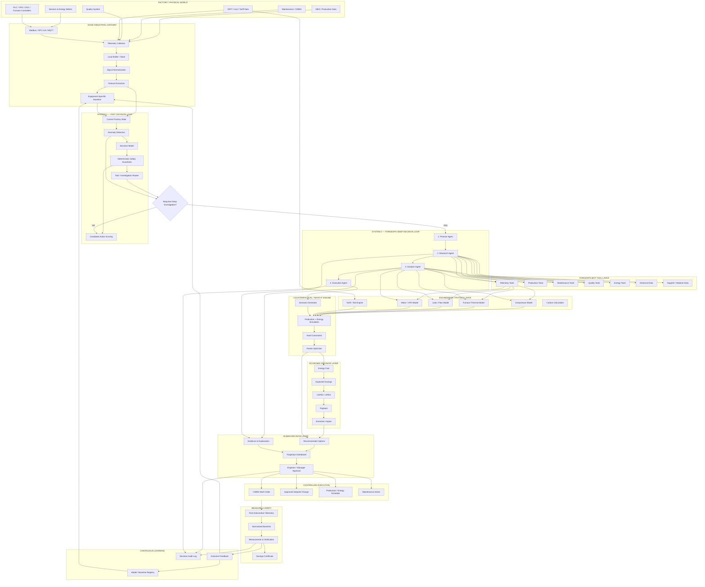

# ForgeOps Energy ⚡

> **Help foundry SMEs investigate specific energy consumption while keeping throughput, quality, safety, and economics in view.**

ForgeOps Energy is an **agentic industrial decision-support prototype** for Indian foundry and forging SMEs. It combines a React/TypeScript workbench, a FastAPI four-role agent pipeline, typed MCP tools, deterministic engineering simulations, and a human review workflow. The Belgaum plant scenario uses synthetic demonstration data; field adapters, physical dispatch, and independent savings verification are not connected in this deployment.

---

## 📑 Table of Contents

1. [Product Overview & Thesis](#1-product-overview--thesis)
2. [The Indian SME Reality & Market Opportunity](#2-the-indian-sme-reality--market-opportunity)
3. [Mathematical Formulation & Hard Constraints](#3-mathematical-formulation--hard-constraints)
4. [End-to-End System Architecture](#4-end-to-end-system-architecture)
5. [The Decision 2.0 Intelligence Architecture (Dual-Process AI)](#5-the-decision-20-intelligence-architecture-dual-process-ai)
6. [Model Context Protocol (MCP) Server Specification](#6-model-context-protocol-mcp-server-specification)
7. [Industrial Case Study: Belgaum Foundry Incident](#7-industrial-case-study-belgaum-foundry-incident)
8. [Frontend Design System & Interactive Modules](#8-frontend-design-system--interactive-modules)
9. [Backend Agent Orchestration & REST API](#9-backend-agent-orchestration--rest-api)
10. [BEE ADEETIE Alignment, Solar Arbitrage & Decarbonisation](#10-bee-adeetie-alignment--sme-economics)
11. [Repository Structure](#11-repository-structure)
12. [Installation & Getting Started](#12-installation--getting-started)
13. [Testing & Verification](#13-testing--verification)
14. [Deployment & Production Readiness](#14-deployment--production-readiness)
15. [Implementation Status & Handoff](#15-implementation-status--handoff)

---

## 1. Product Overview & Thesis

Traditional energy management systems (EMS) in manufacturing act merely as passive recording voltmeters: they display dashboards with kilowatt-hour charts, trigger noisy threshold alarms, and leave the difficult engineering work of root cause investigation to overworked plant engineers.

**ForgeOps Energy** is an **active decision-intelligence platform**. Rather than asking *"What was our energy bill yesterday?"*, ForgeOps continuously computes:

> *"In this synthetic Line 2 scenario, what may explain the modeled +14.3% SEC increase, what evidence would an engineer need to inspect, and which repair options should be simulated before an operator drafts a work order?"*

### The Core Operational Loop

```text
┌────────────────┐      ┌────────────────┐      ┌────────────────┐
│  FACTORY FLOOR │ ───► │  DETECT SPIKE  │ ───► │   INVESTIGATE  │
│ Telemetry & MS │      │  SEC Anomaly   │      │ Multi-MCP Data │
└────────────────┘      └────────────────┘      └───────┬────────┘
                                                        │
┌────────────────┐      ┌────────────────┐              ▼
│  VERIFICATION  │ ◄─── │ HUMAN APPROVAL │ ◄─── ┌────────────────┐
│ 9.2 kWh/t Post │      │ Plant Operator │      │   DIAGNOSE &   │
│ Close Feedback │      │ Sign-off Gate  │      │ OPTIMIZE (SIM) │
└────────────────┘      └────────────────┘      └────────────────┘
```

---

## 2. The Indian SME Reality & Market Opportunity

India's manufacturing sector comprises over 63 million Micro, Small, and Medium Enterprises (MSMEs), contributing ~30% of India's GDP and ~45% of total manufacturing output.

### Structural Industry Bottlenecks:
- **35–40%** of total national energy is consumed by industrial manufacturing.
- **15–30%** of total operational expenditure in Foundries and Forging plants is spent on electrical and thermal energy.
- **70%+ of SME Floors are Fragmented**: Submeters are rarely installed at the machine level, compressed air distribution is chronically leaky (20–40% air loss is typical), and production logs are kept on paper or isolated spreadsheets.
- **Prohibitive Legacy Software**: Traditional Enterprise SCADA / EMS solutions cost ₹15,00,000 to ₹50,00,000+ with 9-month deployment cycles—out of reach for typical tier-2/3 SMEs.

### The ForgeOps Low-CapEx Advantage:
- **Plug-and-Play Edge Hardware**: Retrofit with DIN-rail edge gateways (Modbus RS-485 / MQTT) costing ₹20,000 – ₹60,000.
- **Non-Invasive**: Reads existing meter pulse outputs, clamp-on CT sensors, and pneumatic pressure transducers without halting the production line.
- **Payback**: A site-specific scenario metric based on measured savings, installed cost, production schedule, and tariff. No guaranteed period is asserted.

---

## 3. Mathematical Formulation & Hard Constraints

ForgeOps Energy operates as a constrained optimization problem. It balances thermodynamic physics with hard factory production constraints.

### 1. Primary Objective Function
Minimize Specific Energy Consumption (SEC) per unit of verified good output:

$$\min \text{SEC} = \min \left( \frac{\text{Total Electrical Energy (kWh)} + \text{Thermal Equivalent (kWh)}}{\text{Good Net Output (Metric Tons)}} \right)$$

### 2. Hard Operational Constraints
Any proposed intervention or setpoint change generated by the agents must strictly satisfy:

$$\text{Throughput} \ge \text{Throughput}_{\text{baseline}} \quad (\text{e.g., } \ge 10.2 \text{ t/h})$$

$$\text{Rejection Rate} \le \text{Rejection}_{\text{threshold}} \quad (\text{e.g., } \le 2.4\%)$$

$$\text{Pneumatic Pressure} \ge P_{\text{min\_clamping}} \quad (\text{e.g., } \ge 5.5 \text{ bar for safety interlocks})$$

$$\text{Thermal Holding Temp} \in [T_{\text{min\_liquidus}} + \Delta T, T_{\text{max\_oxidation}}] \quad (\text{Foundry pouring: } 1420^\circ\text{C} - 1460^\circ\text{C})$$

### 3. Economic Viability Constraint
CapEx and OpEx for any proposed intervention must produce positive NPV within the operational fiscal quarter:

$$\text{Simple Payback (Months)} = \frac{\text{Installed Cost (₹)}}{\text{Net Monthly Savings (₹)}}$$

Payback is a site-specific scenario metric, not a guaranteed target; net savings must deduct recurring software, maintenance, and other operating costs.

---

## 4. End-to-End System Architecture

The system is built as a **closed-loop industrial decision harness**, not just an agent pipeline:

> **Sense → Normalize → Baseline → Detect → Investigate → Explain → Simulate → Optimize → Approve → Execute → Measure → Verify → Learn**

### 4.1 Complete Architecture Topology



### 4.2 The 8 Major Harness Layers

| Layer | Responsibility | Runtime / Technology |
|---|---|---|
| **L0 Factory** | Synthetic demonstration records; live sensors, PLCs, MES, CMMS, QMS, ERP not connected | Adapter targets: Modbus RTU / RS-485, OPC-UA, 4-20mA, SQL |
| **L1 Edge** | Local baseline service and anomaly screening; field ingestion and durable buffer not deployed | Python prototype; gateway integration is future work |
| **L2 System 1** | Calibrated deterministic routing fallback and explicit application-level safety checks | Optional local Decision-2.0 snapshot loader; weights absent in current runtime |
| **L3 System 2** | Bounded 4-Agent deliberative investigation and competing hypotheses | Planner &rarr; Research &rarr; Analysis &rarr; Execution |
| **L4 Engineering** | Deterministic thermodynamics, isentropic curves, and ToD tariffs | Python / TypeScript Physics Engine (`simulation/engine`) |
| **L5 Decision** | Counterfactual what-if simulation, hard constraints, Pareto frontier | Multi-objective optimizer, BEE ADEETIE CapEx model |
| **L6 Human** | Evidence inspection, option selection, and recorded demo approval | Work-order record is simulated; no live CMMS dispatch or PLC control |
| **L7 Verification** | IPMVP-inspired normalization calculations on synthetic scenario inputs | Scenario estimate only; no field-verified or certified savings |

**Current runtime qualification:** The `vllm-sr/Decision-2.0-Sol-2B` snapshot is downloaded locally at `models/Decision-2.0-Sol-2B` (revision `64235bef55dad29387dd16da7c90e038bf2f0972`; about 4.8 GB of safetensor weights). System 1 still runs its calibrated deterministic fallback: this machine's installed Transformers is 4.57.6, below the model card's `>=5.17` requirement, and `import torch` currently fails with a Windows DLL load error. Windows has not exposed an NVIDIA adapter to this process, so CUDA inference has not been validated. The native loader remains opt-in, uses local files only, and does not download weights at application startup. A downloaded snapshot is not evidence that inference is active. Factory telemetry and the Belgaum incident records shown in the UI are demonstration fixtures unless a specific source is identified as connected and verified.

**Local Sol-2B snapshot:** The backend discovers `models/Decision-2.0-Sol-2B` automatically; set `FORGEOPS_DECISION2_MODEL_PATH` only to override it. Set `FORGEOPS_LOAD_DECISION2_WEIGHTS=true` only after installing a compatible PyTorch/CUDA runtime and Transformers `>=5.17,<6`. On PowerShell, for example:

```powershell
$env:FORGEOPS_LOAD_DECISION2_WEIGHTS = 'true'
python -m uvicorn backend.main:app --host 127.0.0.1 --port 8000
```

The model code uses `trust_remote_code=True`; review the downloaded model code before enabling it. Keep the multi-gigabyte snapshot local and out of source control.

### 4.3 Key Design Principle

> **ForgeOps is not four agents chatting with each other.**  
> It is an **industrial decision harness around factory data**:  
> • AI provides reasoning  
> • Engineering provides physical validity  
> • Economics provides business viability  
> • Human provides authorization  
> • Measurement proves whether the intervention worked.


---

## 5. The Decision 2.0 Intelligence Architecture (Dual-Process AI)

Industrial manufacturing cannot tolerate hallucinations, latency spikes, or non-deterministic behavior. ForgeOps Energy implements a **Decision 2.0 Dual-Process AI Architecture**, combining ultra-fast, non-autoregressive **System 1 Edge Intelligence** with a deliberative **System 2 Bounded 4-Agent Pipeline**:

```text
┌─────────────────────────────────────────────────────────────────────────┐
│                      SYSTEM 1: FAST EDGE INTELLIGENCE                   │
│   Non-Autoregressive Decision Engine (CLM-8B / Laya Edge Inspired)      │
│   • Executes on ₹20,000 DIN-Rail Industrial Gateways in < 20 ms         │
│   • Hard Safety Interlock Verification (P >= 5.5 bar, ISO 10816 Vib)    │
│   • Continuous Edge Telemetry Screening & Anomaly Trigger Filter        │
└────────────────────────────────────┬────────────────────────────────────┘
                                     │ Anomaly Triggered (>85% Conf)
                                     ▼
┌─────────────────────────────────────────────────────────────────────────┐
│                SYSTEM 2: DELIBERATIVE 4-AGENT PIPELINE                  │
│ ┌───────────────────┐ ┌───────────────────┐ ┌─────────────────────────┐ │
│ │ 1. PLANNER AGENT  │ │ 2. RESEARCH AGENT │ │   3. ANALYSIS AGENT     │ │
│ │ Intent & Boundary │ │ MCP Data Fetcher  │ │ Causal DAG & What-If Sim│ │
│ └─────────┬─────────┘ └─────────┬─────────┘ └────────────┬────────────┘ │
│           │                     │                        │              │
│           ▼                     ▼                        ▼              │
│ ┌─────────────────────────────────────────────────────────────────────┐ │
│ │ 4. EXECUTION AGENT (Pareto Frontier Optimization & Work Order Draft)│ │
│ └─────────────────────────────────────────────────────────────────────┘ │
└─────────────────────────────────────────────────────────────────────────┘
```

Rather than using a single monolithic LLM that hallucinates calculations, each agent has an isolated responsibility and explicit contract:

### 1. 🎯 Planner Agent (`backend/agents/planner/planner.py`)
- **Responsibility**: Semantic intent classification and mathematical problem framing.
- **Logic**:
  - Classifies user or trigger intent into: `show_evidence`, `explain_exclusion`, `compare_options`, `constraint_query`, `generate_report`, or `simulate`.
  - Establishes mathematical objective: $\min \text{SEC} = \frac{\text{kWh}}{\text{Good Output}}$.
  - Formulates hard boundary constraints ($\text{Throughput} \ge 10.2\text{ t}$, $\text{Quality} \ge 97.6\%$, $\text{Safety Interlocks} = \text{Preserved}$).
  - Determines required MCP tools sequence and passes downstream.
  - **Zero Manufacturing Facts**: The Planner never invents numbers; it only coordinates workflow.

### 2. 🔍 Research Agent (`backend/agents/research/research.py`)
- **Responsibility**: Multi-domain telemetry retrieval via the Model Context Protocol (MCP).
- **Logic**:
  - Calls read-only MCP tools across five segregated factory domains:
    - **Energy**: Submeter active power, compressor load hours, power factor, peak demand register.
    - **MES**: Batch run logs, casting tonnage, line cycle times, heat numbers.
    - **Maintenance (CMMS)**: Equipment maintenance logs, overdue PM schedules, vibration alarms.
    - **Quality**: Radiographic test rejection rates, sand mold inclusions, metallurgical hardness.
  - Assembles a cryptographically traceable, tamper-evident `EvidenceBundle` containing timestamps, units, and raw sensor readings.

### 3. 🔬 Analysis Agent (`backend/agents/analysis/analysis.py`)
- **Responsibility**: Causal root-cause isolation and physics-based counterfactual simulation.
- **Logic**:
  - Performs Bayesian causal inference over the evidence bundle.
  - Evaluates cross-correlations: identifies that compressor power spiked while pneumatic line pressure dropped from 7.2 to 6.1 bar ($R^2 = 0.94$).
  - Rules out invalid hypotheses (e.g., rejects "motor bearing failure" because vibration spectra are within ISO 10816 baseline; rejects "mold sand dampness" because moisture sensors read normal 3.2%).
  - Executes live counterfactual simulations against the thermodynamic model across candidate interventions.

### 4. ⚡ Execution Agent (`backend/agents/execution/execution.py`)
- **Responsibility**: Multi-criteria Pareto trade-off optimization, UI orchestration, and report dispatch.
- **Logic**:
  - Computes Pareto frontiers balancing **Energy Saved (kWh)** vs **Implementation Cost (₹)** vs **Production Downtime (minutes)**.
  - Formulates the optimal recommendation (Option C: Manifold seal repair + setpoint trim to 6.5 bar).
  - Prepares a proposed work-order draft for operator review; no live CMMS adapter or dispatch is connected.
  - Emits declarative UI state mutations to synchronize the frontend charts, DAG graph highlights, and interactive sliders.

---

## 6. Model Context Protocol (MCP) Server Specification

The MCP server is located at `forgeops-mcp/` and provides typed tools adhering to the Model Context Protocol standard:

| Module | Tool Name | Description | Key Parameters |
|---|---|---|---|
| **energy** | `get_energy_telemetry` | Real-time electrical submeter power, SEC, voltage, current, PF | `time_range`, `line_id` |
| **energy** | `get_compressed_air_metrics` | Compressor power (kW), line pressure (bar), airflow (CFM), VFD % | `compressor_id` |
| **mes** | `get_batch_history` | Production volume, good tonnage vs scrap, cycle time per batch | `batch_id` |
| **mes** | `get_production_path` | Step-by-step routing of batch through foundry stations | `batch_id` |
| **mes** | `get_queue_events` | Buffer hold times and intermediate storage delays | `batch_id` |
| **maintenance** | `get_machine_alerts` | CMMS failure notifications, threshold crossings, alarms | `machine_id` |
| **maintenance** | `get_maintenance_state` | Preventive maintenance schedules, past repair logs | `machine_id` |
| **materials** | `get_supplier_lot_info` | Raw material chemistry, pig iron grade, supplier certification | `lot_id` |
| **materials** | `get_material_constraints`| Metallurgy chemistry limits (C, Si, Mn, P, S) | `material_type` |
| **quality** | `get_defect_records` | Rejections, surface blowholes, porosity, sand inclusions | `batch_id` |
| **quality** | `get_inspection_results`| Tensile strength, Brinell hardness (BHN), ultrasonic test | `batch_id` |
| **simulation** | `run_scenario` | Counterfactual physics engine simulating pneumatic/energy changes | `leak_pct`, `pressure_setpoint` |
| **orchestrator** | `get_incident_summary` | Full aggregated multi-domain incident dossier | `incident_id` |
| **orchestrator** | `get_timeline` | High-resolution synchronized timeline of all factory events | `batch_id` |
| **orchestrator** | `get_causal_graph` | Causal directed acyclic graph (DAG) nodes & probability edges | `batch_id` |
| **orchestrator** | `get_recommendations`| Pareto-ranked actionable engineering interventions | `batch_id` |
| **orchestrator** | `get_business_impact` | Scenario cost and simple payback using editable assumptions | `batch_id` |

---

## 7. Synthetic Demonstration Scenario: Belgaum Foundry

**Evidence boundary:** every plant, meter, maintenance, production, and quality record in this case study is synthetic demonstration data. The numbers exercise the workflow; they do not describe a real customer or measured intervention. The scenario assumes 9.8 kWh/t normal SEC, 11.2 kWh/t incident SEC, and 9.2 kWh/t modeled output. That is 17.9% below the incident point and 6.1% below the normal reference. Throughput and yield values are modeled guardrails, not proof of real-world preservation.

### Plant Context
- **Location**: Belgaum Industrial Area, Karnataka, India.
- **Facility**: Grey & SG Iron Automotive Casting SME.
- **Equipment**: Twin 1.5-ton medium-frequency induction furnaces, high-pressure green sand molding line, 75 kW rotary screw air compressor with VFD.
- **Electricity Tariff**: ₹8.20 / kWh (Peak ToD rate: ₹9.84 / kWh).

### High-Resolution Incident Timeline:

| Time | Stage | Synthetic scenario inputs | Demonstrated workflow |
|---|---|---|---|
| **08:30 AM** | **1. Anomaly Detected** | Fixture SEC moves from **9.8 kWh/t to 11.2 kWh/t (+14.3%)**. Fixture output is 10.2 t/h. | **Planner Agent** flags the synthetic deviation and starts the demo investigation. |
| **08:33 AM** | **2. Causal Investigation** | Fixture values represent compressor load, line pressure, current, and maintenance notes. | **Research & Analysis Agents** compare hypotheses and show a leak hypothesis with evidence. Confidence is model-generated, not a statistical field finding. |
| **08:35 AM** | **3. Counterfactual Simulation** | Compares illustrative leak-repair and pressure-setpoint scenarios. SEC, cost, and payback are fixture outputs. | **Execution Agent** ranks options for human review; it does not issue a real work order. |
| **08:37 AM** | **4. Human Sign-Off Gate** | A demo operator reviews the evidence bundle and modeled changeover window. | The prototype demonstrates an approval record; no live CMMS is connected. |
| **11:30 AM** | **5. Post-Action Scenario** | Fixture assumes a modeled output SEC of 9.2 kWh/t; no post-action edge telemetry exists. | View demonstrates a future M&V comparison. No actual intervention, preserved throughput, or realized savings is claimed. |

---

## 8. Frontend Design System & Interactive Modules

The user interface is built with **React 18 + Vite + TypeScript**, engineered for harsh industrial lighting and control room environments.

### Dual Operating Modes (Light & Dark)
- 🌙 **Industrial Dark Mode (`theme-dark`)**: Designed for control rooms and SCADA terminals. High-contrast deep slate canvas (`#0b0f19`), neon green operational status accents (`#00e5a3`), and amber warning indicators (`#f59e0b`).
- ☀️ **Clean Daylight Operations Mode (`theme-light`)**: Designed for sunlit shop floor tablets and office management PCs. Clean porcelain background (`#f8fafc`), crisp borders (`#e2e8f0`), high-legibility dark navy text (`#0f172a`), and color-calibrated buttons that maintain visual weight and hierarchy across both themes.

### Typography
- **Plus Jakarta Sans**: Used for modern, ultra-legible dashboard metrics, navigation, section titles, and action buttons.
- **JetBrains Mono**: Used for all raw industrial sensor values, machine IDs (`MCH-B-007`), engineering units, and time-stamped log lines.

### Core Modules & Views:
1. **⚡ Energy Overview (`HomeDashboard.tsx`)**: Synthetic demonstration KPIs, SEC gauges, example alerts, and fixture charts. Not connected to live plant telemetry.
2. **🤖 Agentic Decision Workbench (`Workbench.tsx`)**: The central operational cockpit featuring:
   - **Agent Pipeline Status**: Real-time visualization of Planner, Research, Analysis, and Execution agent states.
   - **Interactive Causal DAG (`GraphPanel.tsx`)**: Visual node network isolating root cause with confidence scores.
   - **What-If Physics Simulator (`SimulatorPanel.tsx`)**: Interactive sliders to model pressure reductions, leak remediations, and VFD setpoints.
   - **Evidence Explorer (`EvidencePanel.tsx`)**: Inspectable demo evidence packets with fixture provenance; claims are not independently verified.
   - **Recommendations & Approval Gate (`RecommendationsPanel.tsx`)**: Operator review interface for scenario estimates. Approval is recorded in the prototype; external work-order dispatch is not connected.
3. **🏭 Foundry User Story (`FoundryUserStoryView.tsx`)**: Guided 5-phase interactive narrative of the Belgaum SME incident for training, demonstrations, and operator onboarding.
4. **🏗️ Architecture & Blueprint Explorer (`ArchitectureView.tsx`)**: In-page interactive system schematic displaying data flow from shop floor sensors to cloud agents with node inspect drawers.
5. **📊 SME Economics & BEE ADEETIE (`SmeEconomicsView.tsx`)**: Interactive financial calculator calculating scenario payback and indicative emissions; ADEETIE eligibility must be determined by BEE/lender.
6. **🔍 Closed-Loop Verification (`VerificationView.tsx`)**: Scenario M&V calculator demonstrating normalization on synthetic inputs; it does not verify field operation.
7. **💬 Embedded Industrial Copilot (`AskForgeOpsView.tsx`)**: Demo Q&A and scenario responses over fixture data; it has no live factory telemetry connection.

---

## 9. Backend Agent Orchestration & REST API

The backend is built on **FastAPI (Python 3.10+)** with deterministic fallback guarantees and live streaming telemetry support.

### Key REST Endpoints:

#### 1. Execute Multi-Agent Pipeline
```http
POST /api/pipeline/run
Content-Type: application/json

{
  "query": "Why did Line 2 SEC spike to 11.2 kWh/ton during Shift A?",
  "incident_id": "INC-2407-001",
  "batch_id": "B-2407-184",
  "constraints": {
    "min_throughput_tonnage": 10.0,
    "max_downtime_minutes": 60
  }
}
```
**Response**: Returns the complete execution dossier including Planner execution graph, Research evidence bundle, Analysis causal graph, and Execution Pareto recommendations.

#### 2. Run What-If Simulation
```http
POST /api/simulate
Content-Type: application/json

{
  "name": "Line 2 Manifold Leak Repair + Pressure Setpoint Trim",
  "inputs": {
    "leak_reduction_pct": 100,
    "line_pressure_bar": 6.5,
    "compressor_vfd_mod_pct": 65
  }
}
```
**Response**: Returns modeled SEC and scenario deltas for the supplied inputs. It does not establish measured savings or plant safety approval.

#### 3. Human Decision Approval & Work Order Dispatch
```http
POST /api/decisions/approve
Content-Type: application/json

{
  "incident_id": "INC-2407-001",
  "recommendation": {
    "option_id": "OPT-C",
    "action": "Repair distribution manifold gasket and trim line pressure to 6.5 bar",
    "cost_inr": 9500,
    "downtime_minutes": 48
  },
  "approved_by": "Vaishak (Shift Supervisor)",
  "agent_conclusion": "Manifold gasket blowout confirmed with 93% confidence."
}
```
**Response**: Persists a local prototype approval/audit record. No external CMMS dispatch is enabled in this deployment.

---

## 10. ADEETIE Alignment & SME Economics

ForgeOps Energy can organize energy, production, proposed-measure, and post-implementation monitoring inputs that an SME and qualified energy auditor may use during an efficiency project. The prototype is not BEE/SIDBI-approved, does not conduct an Investment Grade Energy Audit (IGEA), and does not produce a compliant or bankable DPR. BEE ADEETIE describes 5% interest subvention for eligible micro/small enterprises and 3% for eligible medium enterprises on qualifying loans, subject to scheme terms; it is not a 25% equipment grant. Confirm eligibility, cluster coverage, technology, and loan terms with BEE and the lending institution. [BEE ADEETIE](https://www.beeindia.gov.in/show_content.php?lang=1&level=1&lid=384&ls_id=234) · [SIDHIEE scheme details](https://sidhiee.beeindia.gov.in/ProjectComponent/ADEETIE).

### Illustrative economics (assumptions, not an achieved result)

Assumptions: separate whole-site baseline 3.65 GWh/year; tariff ₹7.80/kWh; 10% modeled energy improvement; installation ₹1.20 lakh; subscription ₹6,000/month; emissions factor 0.82 kg CO₂e/kWh for illustration only. These whole-site assumptions do not share a boundary with the synthetic Line 2 SEC story.

| Metric | Scenario value |
|---|---:|
| Annual baseline energy bill | ₹2.847 crore |
| Avoided energy at 10% | 365,000 kWh/year |
| Gross energy cost reduction | ₹28.47 lakh/year |
| Software fee | ₹0.72 lakh/year |
| Net annual benefit before taxes, maintenance and financing | ₹27.75 lakh/year |
| Simple payback on ₹1.20 lakh installation | 0.52 months |
| Indicative Scope 2 reduction at assumed factor | 299.3 tCO₂e/year |

The result is sensitive to actual good output, operating hours, tariff, savings, sensor coverage, and implementation cost. Measure and normalize SEC before making a savings claim. Preserve throughput, first-pass yield, and safety as acceptance constraints. Do not include government incentives in payback unless approved for the specific borrower and project.

### Additional product directions (not validated claims)

Time-of-day scheduling and thermal fuel switching are future use cases. Their economics depend on local DISCOM tariff orders, production constraints, fuel prices, equipment changes, and verified emissions factors; the demo does not claim a realized arbitrage or fuel-switching result. Carbon summaries are indicative calculations, not certified GHG Protocol/BRSR disclosures or ISO 50001 evidence.

---

## 11. Repository Structure

```
E:\ForgeOps-Energy\
├── backend/                       # FastAPI 4-Agent Pipeline & Orchestration
│   ├── agents/
│   │   ├── planner/               # Agent 1: Goal formulation & boundary constraints
│   │   ├── research/              # Agent 2: MCP multi-domain evidence fetcher
│   │   ├── analysis/              # Agent 3: Causal root cause analyzer & what-if engine
│   │   └── execution/             # Agent 4: Pareto optimizer & UI dispatcher
│   ├── api/                       # API route definitions
│   ├── database/                  # SQLite immutable audit log & decision records
│   ├── llm/                       # Model client integration (NitroChat / Claude / Gemini)
│   ├── mcp/                       # Client connection to ForgeOps MCP server
│   ├── schemas/                   # Pydantic v2 cross-agent message models
│   ├── main.py                    # FastAPI application entry point
│   ├── pipeline.py                # Synchronous and streaming pipeline runners
│   ├── requirements.txt           # Python dependencies
│   └── simulation_reasoning.py    # Counterfactual reconciliation logic
├── forgeops-mcp/                  # Official Model Context Protocol (MCP) Server
│   ├── src/
│   │   ├── data/                  # Industrial plant telemetry datasets
│   │   ├── modules/
│   │   │   ├── energy/            # Submeters, compressors, and SEC tools
│   │   │   ├── maintenance/       # CMMS work orders and machine alert tools
│   │   │   ├── materials/         # Metallurgy and raw material chemistry tools
│   │   │   ├── mes/               # Batch records, tonnage, and throughput tools
│   │   │   ├── orchestrator/      # Incident aggregation and timeline tools
│   │   │   ├── quality/           # Defect rates and metallurgy testing tools
│   │   │   └── simulation/        # Thermodynamic counterfactual engine tools
│   │   ├── app.module.ts          # NitroStack MCP module registrations
│   │   └── index.ts               # MCP Server entry point
│   ├── package.json               # Node dependencies
│   └── tsconfig.json              # TypeScript configuration
├── src/                           # React 18 + Vite + TypeScript Frontend
│   ├── components/                # Reusable UI widgets, modals, and navigation
│   │   ├── AskForgeOpsModal.tsx   # Floating quick query modal
│   │   ├── AskForgeOpsView.tsx    # Full-page industrial copilot assistant
│   │   └── Icons.tsx              # Clean SVG industrial icon library
│   ├── modules/                   # Core application views and workbench panels
│   │   ├── ArchitectureView.tsx   # Interactive technical architecture blueprint
│   │   ├── AssistantPanel.tsx     # 4-agent trace stream and live commentary
│   │   ├── EvidencePanel.tsx      # Immutable cryptographic sensor evidence tree
│   │   ├── FoundryUserStoryView.tsx # 5-stage Belgaum foundry interactive narrative
│   │   ├── GraphPanel.tsx         # Causal directed acyclic graph (DAG)
│   │   ├── HomeDashboard.tsx      # High-level SEC telemetry & anomaly monitors
│   │   ├── RecommendationsPanel.tsx # Operator sign-off & work order approval gate
│   │   ├── ReplayPanel.tsx        # High-resolution telemetry time-scrubber
│   │   ├── SimulatorPanel.tsx     # What-If scenario sandbox with sliders
│   │   ├── SmeEconomicsView.tsx   # IGEA, CapEx ROI, and BEE ADEETIE calculator
│   │   ├── TimelinePanel.tsx      # Multi-stream millisecond event timeline
│   │   ├── VerificationView.tsx   # Post-repair closed-loop telemetry verifier
│   │   └── Workbench.tsx          # Master 4-agent decision cockpit
│   ├── App.tsx                    # Root routing, view controller, and navigation
│   ├── FocusContext.tsx           # Cross-panel synchronized node highlight context
│   ├── mockData.ts                # Synthetic foundry demonstration fixtures
│   ├── energy-styles.css          # Core CSS variables, typography, and layout rules
│   ├── schneider-theme.css        # Enterprise SCADA theme styling tokens
│   ├── theme.css                  # Light / Dark theme color tokens and classes
│   └── types.ts                   # Complete TypeScript domain interfaces
├── index.html                     # HTML5 entry point with SEO metadata
├── package.json                   # Frontend npm dependencies
├── tsconfig.json                  # Frontend TypeScript configuration
└── vite.config.ts                 # Vite bundler build settings
```

---

## 12. Installation & Getting Started

### 12.1 Render backend deployment (no-card free tier)

The repository includes [`render.yaml`](./render.yaml) and [`Dockerfile`](./Dockerfile)
for a deployable Render blueprint:

1. Create a Render account and connect this GitHub repository.
2. Choose **Blueprint** and apply `render.yaml`.
3. Render creates only the Dockerized FastAPI backend and its temporary SQLite database.
4. The backend uses the free plan and stores SQLite files under `/tmp`; these
   files are ephemeral and can be lost when Render restarts or redeploys it.
5. Deploy the frontend separately on Vercel. Set its build-time API variables
   to the Render backend URL:

   ```text
   VITE_FORGEOPS_API_URL=https://forgeops-energy-api.onrender.com
   VITE_ROLE3_API_URL=https://forgeops-energy-api.onrender.com
   VITE_ROLE1_AGENT_URL=https://forgeops-energy-api.onrender.com/api/agent/pipeline
   ```

6. Set `FORGEOPS_MCP_URL`, `NITROCHAT_BASE_URL`, and any provider keys in the
   backend service environment before enabling live agents.

This no-card configuration is suitable for demos and testing. For durable
audit history, use a managed PostgreSQL database or a paid persistent disk
before production deployment.

### Prerequisites
- **Node.js**: `v18.0.0` or later
- **Python**: `3.10` or later
- **Package Managers**: `npm` and `pip`

### Step 1: Clone the Repository
```bash
git clone https://github.com/shalcoder/ForgeOps-Energy.git E:\ForgeOps-Energy
cd E:\ForgeOps-Energy
```

### Step 2: Install and Run Frontend (React 18 + Vite)
```bash
# Install frontend dependencies
npm install

# Start development server
npm run dev
```
The application will start immediately at `http://localhost:5173/`.

### Step 3: Install and Run Backend (FastAPI Agent Engine)
In a separate terminal window:
```bash
cd E:\ForgeOps-Energy
python -m venv .venv
# Windows PowerShell:
.venv\Scripts\Activate.ps1
# Linux/macOS:
source .venv/bin/activate

pip install -r backend/requirements.txt
python -m uvicorn backend.main:app --host 0.0.0.0 --port 8000 --reload
```
The FastAPI interactive documentation is available at `http://localhost:8000/docs`.

### Step 4: Run the local MCP server (optional)

The repository also contains a local NitroStack MCP service:

```bash
cd E:\ForgeOps-Energy\forgeops-mcp
npm install
npm run api
```

Run the MCP verification suite with:

```bash
npm run verify
```

### Step 5: Configure optional live services

The repository works offline with deterministic calibrated fallbacks. Configure
live agent/MCP services only when their endpoints and credentials are available:

```bash
# PowerShell:
$env:FORGEOPS_LIVE_AGENTS = "true"
$env:FORGEOPS_MCP_URL = "https://your-mcp-endpoint/mcp"
$env:FORGEOPS_DECISION2_MODEL_PATH = "C:\models\Decision-2.0-Sol-2B"
```

The native Decision 2.0 loader is opt-in:

```bash
$env:FORGEOPS_LOAD_DECISION2_WEIGHTS = "true"
```

Without local model weights, the application reports the calibrated deterministic
fallback. The API endpoint `GET /api/system/status` reports the active System 1
runtime, model package versions, local weight readiness, remote MCP reachability,
and plant-integration status. The endpoint never initiates a model download.

---

## 13. Testing & Verification

ForgeOps Energy includes automated tests for agent contracts, edge anomaly
screening, safety guardrails, MCP tools, physics, economics, M&V, and simulation
boundaries.

### Run Python Backend Tests
```bash
pytest backend/tests/ -v
```
**Test Coverage Includes**:
- `test_agent_pipeline.py`: Validates that Planner correctly breaks down intents, Research executes only read-only tools, Analysis builds valid DAG graphs, and Execution respects throughput constraints.
- `test_decision_approval.py`: Validates SQLite audit trail logging and atomic state transitions upon operator approval.
- `test_nitrochat_client.py`: Verifies resilience and deterministic fallback behavior during LLM latency spikes.
- `test_closed_loop_harness.py`: Validates factory state, equipment envelopes, System 1 anomaly detection, competing hypotheses, MCP tools, payback, and feedback persistence.
- `test_decision2_engine.py`: Validates typed Decision 2.0 responses, fast tool routing, and pressure/vibration interlocks.
- `test_physics_simulation.py`: Exercises thermodynamics, compressor/furnace models, Pareto selection, tariffs, illustrative economics and normalization, carbon calculations, and simulation guardrails.

Focused validation command:

```bash
pytest -q backend/tests/test_closed_loop_harness.py backend/tests/test_decision2_engine.py backend/tests/test_physics_simulation.py
```

The current focused suite passes with **24 tests**.

### Validate Frontend Production Build
```bash
npm run build
```
Generates an optimized, tree-shaken static production bundle in `dist/`.

---

## 14. Deployment & Production Readiness

### Production Environment Options:
1. **Frontend**: The Vite frontend can be deployed directly to **Vercel**, **Cloudflare Pages**, or **AWS S3 + CloudFront**.
2. **Edge Gateway**: The gateway service runs on local industrial PCs (Advantech, Moxa, or Raspberry Pi CM4) running Ubuntu Core.
3. **Backend and MCP boundary**: Package the FastAPI service for Docker or
   Kubernetes. The controlled tools live under `backend/mcp/` and can connect
   to an external MCP endpoint through `FORGEOPS_MCP_URL`:

```yaml
# docker-compose.yml example
version: '3.8'
services:
  forgeops-frontend:
    build: .
    ports:
      - "80:80"
    restart: always

  forgeops-backend:
    build: ./backend
    ports:
      - "8000:8000"
    environment:
      - FORGEOPS_MCP_URL=https://your-mcp-endpoint/mcp
    restart: always
```

### Prototype boundary

The current implementation is a tested prototype using synthetic pilot
telemetry and controlled/read-only tool boundaries. It does not directly write
to PLCs, MES, CMMS, QMS, or plant controllers. Production deployment requires
authenticated adapters, authorization, network segmentation, field
commissioning, and a safety review before enabling control actions.

---

## 15. Implementation Status & Handoff

The architecture is implemented end-to-end at prototype level:

| Layer | Status | Current implementation |
|---|---|---|
| Factory telemetry, MES, CMMS, quality | **Partial / simulated** | Controlled MCP tools model these sources; live PLC, Modbus, OPC-UA, MQTT, MES, CMMS, and QMS adapters remain to be integrated. |
| Edge ingestion and baseline | **Implemented locally** | Equipment-specific envelopes and anomaly screening are implemented in `backend/edge/baseline_service.py`; field ingestion and durable buffering remain future integration work. |
| System 1 fast loop | **Deterministic fallback active** | `backend/decision2/decision2_engine.py` provides calibrated routing and explicit rule-based safety checks. Sol-2B snapshot is installed locally; native inference remains opt-in and awaits Transformers 5.17+, a working PyTorch runtime and CUDA device visibility. |
| System 2 deep loop | **Implemented** | Planner → Research → Analysis → Execution is orchestrated by `backend/pipeline.py`. |
| Engineering truth | **Implemented** | `simulation/engine.py` and `simulation/engine.ts` provide compressed-air, compressor, furnace, tariff, carbon, and verification models. |
| What-if and Pareto optimization | **Implemented** | Scenario validation and A–D Pareto recommendations are available through the simulation and MCP layers. |
| Energy and economics | **Scenario calculator** | Payback, tariff, load-shifting, fuel-switching, and indicative emissions estimates use editable assumptions; no savings or eligibility is verified. |
| Human approval and audit | **Implemented locally** | FastAPI approval and audit-export endpoints persist demo decision records in SQLite. |
| Controlled action | **Simulated draft** | Work-order creation returns a proposed demo record for review; there is no CMMS connection or dispatch. |
| Measure and verify | **Scenario calculation only** | IPMVP-inspired baseline normalization and savings calculations operate on synthetic inputs. They do not certify measured savings or compliance. |
| Feedback to baseline/models | **Implemented locally** | Verification feedback is persisted in `backend/database/feedback_registry.db`; automated retraining and external model-registry sync remain future work. |

### Current role personas

| Person | Role | Primary responsibilities |
|---|---|---|
| Vishal | Plant Manager persona | Executive cockpit, opportunities, demo approval gates, and scenario review |
| Vaishak | Energy Manager persona | SEC baselines, tariff scenarios, and indicative carbon reporting |
| Keerthi | Maintenance Engineer persona | Fixture telemetry, root-cause evidence, and proposed work-order drafts |
| Sham | Shopfloor Operator persona | Demo operations, process graph, and illustrative interlock checks |

### Delivered commits

- Platform implementation: `46a882c` — `Update ForgeOps energy platform`
- Handoff documentation: `30dbd5e` — `Add ForgeOps handoff document`
- Both commits were pushed to `origin/main`.
- Detailed delivery record: [`HANDOFF_46A882C.md`](HANDOFF_46A882C.md)

### Production completion checklist

1. Add live Modbus/OPC-UA/MQTT telemetry ingestion and edge buffering.
2. Add authenticated MES, CMMS, QMS, ERP, and tariff adapters.
3. Add durable external baseline/model-registry synchronization.
4. Add real CMMS work-order integration with authorization and idempotency.
5. Complete plant-specific safety review and network segmentation.
6. Add integration, failure-recovery, and deployment tests for each external system.

---

## 📜 License & Compliance

ForgeOps Energy is engineered for industrial resilience, safety compliance, and verifiable energy reduction.
- Designed to support an energy-management improvement workflow; this prototype is not BEE/ADEETIE approved and is not certified to ISO 50001.

---

*ForgeOps Energy — Turning industrial energy data into human-reviewed efficiency decisions.*
