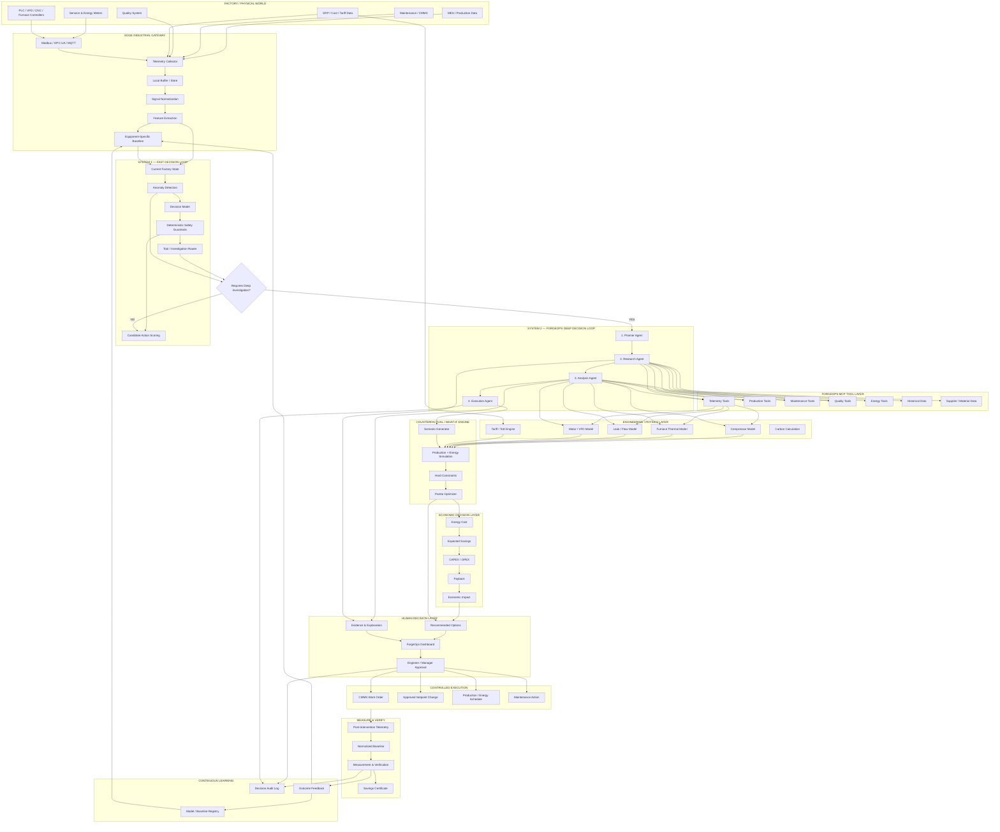

# ForgeOps Energy ⚡

> **Continuously reduce specific energy consumption while preserving throughput, quality, safety, and economic viability.**

An enterprise-grade **agentic industrial decision-intelligence platform** specifically architected for Indian manufacturing SMEs (Foundries, Forging, Heavy Engineering, Steel Fabrication, and Textiles). Aligned with the Bureau of Energy Efficiency (**BEE ADEETIE**) scheme to unlock bankable, investment-grade energy audits and rapid CapEx payback (<3 months).

---

## 📑 Table of Contents

1. [Product Overview & Thesis](#1-product-overview--thesis)
2. [The Indian SME Reality & Market Opportunity](#2-the-indian-sme-reality--market-opportunity)
3. [Mathematical Formulation & Hard Constraints](#3-mathematical-formulation--hard-constraints)
4. [End-to-End System Architecture](#4-end-to-end-system-architecture)
5. [The Decision 2.0 Intelligence Architecture (Dual-Process AI)](#5-the-decision-20-intelligence-architecture-dual-process-ai)
6. [Model Context Protocol (MCP) Server Specification](#6-model-context-protocol-mcp-server-specification)
7. [Industrial Case Study: Belgaum Foundry Incident](#7-industrial-case-study-belgaum-foundry-incident)
8. [Frontend Design System & Interactive Modules](#8-frontend-design-system--interactive-modules)
9. [Backend Agent Orchestration & REST API](#9-backend-agent-orchestration--rest-api)
10. [BEE ADEETIE Alignment, Solar Arbitrage & Decarbonisation](#10-bee-adeetie-alignment--sme-economics)
11. [Repository Structure](#11-repository-structure)
12. [Installation & Getting Started](#12-installation--getting-started)
13. [Testing & Verification](#13-testing--verification)
14. [Deployment & Production Readiness](#14-deployment--production-readiness)

---

## 1. Product Overview & Thesis

Traditional energy management systems (EMS) in manufacturing act merely as passive recording voltmeters: they display dashboards with kilowatt-hour charts, trigger noisy threshold alarms, and leave the difficult engineering work of root cause investigation to overworked plant engineers.

**ForgeOps Energy** is an **active decision-intelligence platform**. Rather than asking *"What was our energy bill yesterday?"*, ForgeOps continuously computes:

> *"Why is Line 2 currently consuming +14.3% more energy per ton of good castings than its baseline, what physical sub-system is failing, what are the Pareto-optimal trade-offs between repair cost and downtime, and what precise work order should be dispatched to fix it?"*

### The Core Operational Loop

```text
┌────────────────┐      ┌────────────────┐      ┌────────────────┐
│  FACTORY FLOOR │ ───► │  DETECT SPIKE  │ ───► │   INVESTIGATE  │
│ Telemetry & MS │      │  SEC Anomaly   │      │ Multi-MCP Data │
└────────────────┘      └────────────────┘      └───────┬────────┘
                                                        │
┌────────────────┐      ┌────────────────┐              ▼
│  VERIFICATION  │ ◄─── │ HUMAN APPROVAL │ ◄─── ┌────────────────┐
│ 9.2 kWh/t Post │      │ Plant Operator │      │   DIAGNOSE &   │
│ Close Feedback │      │ Sign-off Gate  │      │ OPTIMIZE (SIM) │
└────────────────┘      └────────────────┘      └────────────────┘
```

---

## 2. The Indian SME Reality & Market Opportunity

India's manufacturing sector comprises over 63 million Micro, Small, and Medium Enterprises (MSMEs), contributing ~30% of India's GDP and ~45% of total manufacturing output.

### Structural Industry Bottlenecks:
- **35–40%** of total national energy is consumed by industrial manufacturing.
- **15–30%** of total operational expenditure in Foundries and Forging plants is spent on electrical and thermal energy.
- **70%+ of SME Floors are Fragmented**: Submeters are rarely installed at the machine level, compressed air distribution is chronically leaky (20–40% air loss is typical), and production logs are kept on paper or isolated spreadsheets.
- **Prohibitive Legacy Software**: Traditional Enterprise SCADA / EMS solutions cost ₹15,00,000 to ₹50,00,000+ with 9-month deployment cycles—out of reach for typical tier-2/3 SMEs.

### The ForgeOps Low-CapEx Advantage:
- **Plug-and-Play Edge Hardware**: Retrofit with DIN-rail edge gateways (Modbus RS-485 / MQTT) costing ₹20,000 – ₹60,000.
- **Non-Invasive**: Reads existing meter pulse outputs, clamp-on CT sensors, and pneumatic pressure transducers without halting the production line.
- **Direct Payback**: Payback achieved within 1.0 to 3.0 months through immediate elimination of compressor idling, peak demand penalties, and pneumatic leaks.

---

## 3. Mathematical Formulation & Hard Constraints

ForgeOps Energy operates as a constrained optimization problem. It balances thermodynamic physics with hard factory production constraints.

### 1. Primary Objective Function
Minimize Specific Energy Consumption (SEC) per unit of verified good output:

$$\min \text{SEC} = \min \left( \frac{\text{Total Electrical Energy (kWh)} + \text{Thermal Equivalent (kWh)}}{\text{Good Net Output (Metric Tons)}} \right)$$

### 2. Hard Operational Constraints
Any proposed intervention or setpoint change generated by the agents must strictly satisfy:

$$\text{Throughput} \ge \text{Throughput}_{\text{baseline}} \quad (\text{e.g., } \ge 10.2 \text{ t/h})$$

$$\text{Rejection Rate} \le \text{Rejection}_{\text{threshold}} \quad (\text{e.g., } \le 2.4\%)$$

$$\text{Pneumatic Pressure} \ge P_{\text{min\_clamping}} \quad (\text{e.g., } \ge 5.5 \text{ bar for safety interlocks})$$

$$\text{Thermal Holding Temp} \in [T_{\text{min\_liquidus}} + \Delta T, T_{\text{max\_oxidation}}] \quad (\text{Foundry pouring: } 1420^\circ\text{C} - 1460^\circ\text{C})$$

### 3. Economic Viability Constraint
CapEx and OpEx for any proposed intervention must produce positive NPV within the operational fiscal quarter:

$$\text{Simple Payback (Months)} = \frac{\text{Implementation Cost (₹)}}{\text{Verified Monthly Energy Savings (₹)}} \le 3.0 \text{ months}$$

---

## 4. End-to-End System Architecture

The system is built as a **closed-loop industrial decision harness**, not just an agent pipeline:

> **Sense → Normalize → Baseline → Detect → Investigate → Explain → Simulate → Optimize → Approve → Execute → Measure → Verify → Learn**

### 4.1 Complete Architecture Topology



### 4.2 The 8 Major Harness Layers

| Layer | Responsibility | Runtime / Technology |
|---|---|---|
| **L0 Factory** | Sensors, PLCs, submeters, MES, CMMS, QMS, ERP | Modbus RTU / RS-485, OPC-UA, 4-20mA, SQL |
| **L1 Edge** | Telemetry ingestion, 72h buffering, normalization, learned asset baseline | DIN-Rail IPC, Python / Node.js, SQLite ring buffer |
| **L2 System 1** | Sub-10ms fast anomaly detection and deterministic safety screening | `Decision-2.0-Sol-2B` (RTX 3060) / `Kai-0.6B` (Edge) |
| **L3 System 2** | Bounded 4-Agent deliberative investigation and competing hypotheses | Planner &rarr; Research &rarr; Analysis &rarr; Execution |
| **L4 Engineering** | Deterministic thermodynamics, isentropic curves, and ToD tariffs | Python / TypeScript Physics Engine (`simulation/engine`) |
| **L5 Decision** | Counterfactual what-if simulation, hard constraints, Pareto frontier | Multi-objective optimizer, BEE ADEETIE CapEx model |
| **L6 Human** | Evidence inspection, option selection, approval gate, and CMMS dispatch | Modern Dark Dashboard, Work Order API (Read-only/Simulated) |
| **L7 Verification** | Post-repair IPMVP Option B/C verification & prediction error loopback | Normalized regression, 14.3% error feedback to registry |

### 4.3 Key Design Principle

> **ForgeOps is not four agents chatting with each other.**  
> It is an **industrial decision harness around factory data**:  
> • AI provides reasoning  
> • Engineering provides physical validity  
> • Economics provides business viability  
> • Human provides authorization  
> • Measurement proves whether the intervention worked.


---

## 5. The Decision 2.0 Intelligence Architecture (Dual-Process AI)

Industrial manufacturing cannot tolerate hallucinations, latency spikes, or non-deterministic behavior. ForgeOps Energy implements a **Decision 2.0 Dual-Process AI Architecture**, combining ultra-fast, non-autoregressive **System 1 Edge Intelligence** with a deliberative **System 2 Bounded 4-Agent Pipeline**:

```text
┌─────────────────────────────────────────────────────────────────────────┐
│                      SYSTEM 1: FAST EDGE INTELLIGENCE                   │
│   Non-Autoregressive Decision Engine (CLM-8B / Laya Edge Inspired)      │
│   • Executes on ₹20,000 DIN-Rail Industrial Gateways in < 20 ms         │
│   • Hard Safety Interlock Verification (P >= 5.5 bar, ISO 10816 Vib)    │
│   • Continuous Edge Telemetry Screening & Anomaly Trigger Filter        │
└────────────────────────────────────┬────────────────────────────────────┘
                                     │ Anomaly Triggered (>85% Conf)
                                     ▼
┌─────────────────────────────────────────────────────────────────────────┐
│                SYSTEM 2: DELIBERATIVE 4-AGENT PIPELINE                  │
│ ┌───────────────────┐ ┌───────────────────┐ ┌─────────────────────────┐ │
│ │ 1. PLANNER AGENT  │ │ 2. RESEARCH AGENT │ │   3. ANALYSIS AGENT     │ │
│ │ Intent & Boundary │ │ MCP Data Fetcher  │ │ Causal DAG & What-If Sim│ │
│ └─────────┬─────────┘ └─────────┬─────────┘ └────────────┬────────────┘ │
│           │                     │                        │              │
│           ▼                     ▼                        ▼              │
│ ┌─────────────────────────────────────────────────────────────────────┐ │
│ │ 4. EXECUTION AGENT (Pareto Frontier Optimization & Work Order Draft)│ │
│ └─────────────────────────────────────────────────────────────────────┘ │
└─────────────────────────────────────────────────────────────────────────┘
```

Rather than using a single monolithic LLM that hallucinates calculations, each agent has an isolated responsibility and explicit contract:

### 1. 🎯 Planner Agent (`backend/agents/planner/planner.py`)
- **Responsibility**: Semantic intent classification and mathematical problem framing.
- **Logic**:
  - Classifies user or trigger intent into: `show_evidence`, `explain_exclusion`, `compare_options`, `constraint_query`, `generate_report`, or `simulate`.
  - Establishes mathematical objective: $\min \text{SEC} = \frac{\text{kWh}}{\text{Good Output}}$.
  - Formulates hard boundary constraints ($\text{Throughput} \ge 10.2\text{ t}$, $\text{Quality} \ge 97.6\%$, $\text{Safety Interlocks} = \text{Preserved}$).
  - Determines required MCP tools sequence and passes downstream.
  - **Zero Manufacturing Facts**: The Planner never invents numbers; it only coordinates workflow.

### 2. 🔍 Research Agent (`backend/agents/research/research.py`)
- **Responsibility**: Multi-domain telemetry retrieval via the Model Context Protocol (MCP).
- **Logic**:
  - Calls read-only MCP tools across five segregated factory domains:
    - **Energy**: Submeter active power, compressor load hours, power factor, peak demand register.
    - **MES**: Batch run logs, casting tonnage, line cycle times, heat numbers.
    - **Maintenance (CMMS)**: Equipment maintenance logs, overdue PM schedules, vibration alarms.
    - **Quality**: Radiographic test rejection rates, sand mold inclusions, metallurgical hardness.
  - Assembles a cryptographically traceable, tamper-evident `EvidenceBundle` containing timestamps, units, and raw sensor readings.

### 3. 🔬 Analysis Agent (`backend/agents/analysis/analysis.py`)
- **Responsibility**: Causal root-cause isolation and physics-based counterfactual simulation.
- **Logic**:
  - Performs Bayesian causal inference over the evidence bundle.
  - Evaluates cross-correlations: identifies that compressor power spiked while pneumatic line pressure dropped from 7.2 to 6.1 bar ($R^2 = 0.94$).
  - Rules out invalid hypotheses (e.g., rejects "motor bearing failure" because vibration spectra are within ISO 10816 baseline; rejects "mold sand dampness" because moisture sensors read normal 3.2%).
  - Executes live counterfactual simulations against the thermodynamic model across candidate interventions.

### 4. ⚡ Execution Agent (`backend/agents/execution/execution.py`)
- **Responsibility**: Multi-criteria Pareto trade-off optimization, UI orchestration, and report dispatch.
- **Logic**:
  - Computes Pareto frontiers balancing **Energy Saved (kWh)** vs **Implementation Cost (₹)** vs **Production Downtime (minutes)**.
  - Formulates the optimal recommendation (Option C: Manifold seal repair + setpoint trim to 6.5 bar).
  - Prepares the dispatchable CMMS Work Order package with parts list and torque specifications.
  - Emits declarative UI state mutations to synchronize the frontend charts, DAG graph highlights, and interactive sliders.

---

## 6. Model Context Protocol (MCP) Server Specification

The MCP server is located at `forgeops-mcp/` and provides typed tools adhering to the Model Context Protocol standard:

| Module | Tool Name | Description | Key Parameters |
|---|---|---|---|
| **energy** | `get_energy_telemetry` | Real-time electrical submeter power, SEC, voltage, current, PF | `time_range`, `line_id` |
| **energy** | `get_compressed_air_metrics` | Compressor power (kW), line pressure (bar), airflow (CFM), VFD % | `compressor_id` |
| **mes** | `get_batch_history` | Production volume, good tonnage vs scrap, cycle time per batch | `batch_id` |
| **mes** | `get_production_path` | Step-by-step routing of batch through foundry stations | `batch_id` |
| **mes** | `get_queue_events` | Buffer hold times and intermediate storage delays | `batch_id` |
| **maintenance** | `get_machine_alerts` | CMMS failure notifications, threshold crossings, alarms | `machine_id` |
| **maintenance** | `get_maintenance_state` | Preventive maintenance schedules, past repair logs | `machine_id` |
| **materials** | `get_supplier_lot_info` | Raw material chemistry, pig iron grade, supplier certification | `lot_id` |
| **materials** | `get_material_constraints`| Metallurgy chemistry limits (C, Si, Mn, P, S) | `material_type` |
| **quality** | `get_defect_records` | Rejections, surface blowholes, porosity, sand inclusions | `batch_id` |
| **quality** | `get_inspection_results`| Tensile strength, Brinell hardness (BHN), ultrasonic test | `batch_id` |
| **simulation** | `run_scenario` | Counterfactual physics engine simulating pneumatic/energy changes | `leak_pct`, `pressure_setpoint` |
| **orchestrator** | `get_incident_summary` | Full aggregated multi-domain incident dossier | `incident_id` |
| **orchestrator** | `get_timeline` | High-resolution synchronized timeline of all factory events | `batch_id` |
| **orchestrator** | `get_causal_graph` | Causal directed acyclic graph (DAG) nodes & probability edges | `batch_id` |
| **orchestrator** | `get_recommendations`| Pareto-ranked actionable engineering interventions | `batch_id` |
| **orchestrator** | `get_business_impact` | Monetary impact, ROI, electricity tariff cost modeling | `batch_id` |

---

## 7. Industrial Case Study: Belgaum Foundry Incident

### Plant Context
- **Location**: Belgaum Industrial Area, Karnataka, India.
- **Facility**: Grey & SG Iron Automotive Casting SME.
- **Equipment**: Twin 1.5-ton medium-frequency induction furnaces, high-pressure green sand molding line, 75 kW rotary screw air compressor with VFD.
- **Electricity Tariff**: ₹8.20 / kWh (Peak ToD rate: ₹9.84 / kWh).

### High-Resolution Incident Timeline:

| Time | Stage | Real-Time Telemetry & Evidence | Decision & Agent Action |
|---|---|---|---|
| **08:30 AM** | **1. Anomaly Detected** | Specific Energy Consumption (SEC) on Line 2 jumps from baseline **9.8 kWh/ton to 11.2 kWh/ton (+14.3%)**. Good casting tonnage steady at 10.2 tons/hour. | **Planner Agent** flags abnormal energy consumption without throughput justification. Triggers investigation. |
| **08:33 AM** | **2. Causal Investigation** | Compressor power climbs from 52 kW to 68 kW (+30.8%). Air line pressure drops from 7.2 bar to 6.1 bar. Motor current reaches 142A. CMMS shows 3 recurring minor leak reports on Line 2 manifold over 14 days. | **Research & Analysis Agents** correlate pneumatic decay with compressor loading ($R^2 = 0.94$). Rejects furnace & motor fault hypotheses. Confirms 93% confidence in manifold gasket blowout. |
| **08:35 AM** | **3. Counterfactual Simulation** | Evaluates 4 candidate interventions:<br>• **Option A**: Seal leak only $\to$ SEC 9.8 kWh/t, Cost ₹9,500.<br>• **Option B**: Trim pressure to 6.0 bar only $\to$ Inadequate safety margin for mold clamping.<br>• **Option C (Pareto Optimal)**: Seal leak + tune pressure setpoint to 6.5 bar $\to$ SEC 9.2 kWh/t, Cost ₹9,500, Payback 1.5 mo.<br>• **Option D**: Replace 75 kW compressor $\to$ Cost ₹14,50,000, Payback 18 mo (Rejected). | **Execution Agent** selects Option C as Pareto-optimal. Prepares work order package for scheduled tooling changeover at 10:15 AM. |
| **08:37 AM** | **4. Human Sign-Off Gate** | Shift Supervisor (Vaishak) reviews the evidence bundle, financial ROI, and 48-minute changeover window in the Decision Workbench. | **Supervisor Vaishak** clicks **[Approve Intervention]**. Dispatching CMMS Work Order `WO-ENG-8821`. |
| **11:30 AM** | **5. Closed-Loop Verification** | Maintenance team replaces EPDM flange gasket and recalibrates pressure regulator during shift change. Edge telemetry measures actual response. | **Closed-Loop Verification View** registers SEC drop to **9.2 kWh/ton (-18.0%)**. Plant throughput preserved at 10.2 t/h. Defect rate unchanged (2.4%). **1,840 kWh/day (₹6,240/day) permanently saved.** |

---

## 8. Frontend Design System & Interactive Modules

The user interface is built with **React 18 + Vite + TypeScript**, engineered for harsh industrial lighting and control room environments.

### Dual Operating Modes (Light & Dark)
- 🌙 **Industrial Dark Mode (`theme-dark`)**: Designed for control rooms and SCADA terminals. High-contrast deep slate canvas (`#0b0f19`), neon green operational status accents (`#00e5a3`), and amber warning indicators (`#f59e0b`).
- ☀️ **Clean Daylight Operations Mode (`theme-light`)**: Designed for sunlit shop floor tablets and office management PCs. Clean porcelain background (`#f8fafc`), crisp borders (`#e2e8f0`), high-legibility dark navy text (`#0f172a`), and color-calibrated buttons that maintain visual weight and hierarchy across both themes.

### Typography
- **Plus Jakarta Sans**: Used for modern, ultra-legible dashboard metrics, navigation, section titles, and action buttons.
- **JetBrains Mono**: Used for all raw industrial sensor values, machine IDs (`MCH-B-007`), engineering units, and time-stamped log lines.

### Core Modules & Views:
1. **⚡ Energy Overview (`HomeDashboard.tsx`)**: High-level real-time plant KPIs, SEC gauges, active factory alerts, Line 1 vs Line 2 telemetry charts, and peak tariff band indicators.
2. **🤖 Agentic Decision Workbench (`Workbench.tsx`)**: The central operational cockpit featuring:
   - **Agent Pipeline Status**: Real-time visualization of Planner, Research, Analysis, and Execution agent states.
   - **Interactive Causal DAG (`GraphPanel.tsx`)**: Visual node network isolating root cause with confidence scores.
   - **What-If Physics Simulator (`SimulatorPanel.tsx`)**: Interactive sliders to model pressure reductions, leak remediations, and VFD setpoints.
   - **Evidence Explorer (`EvidencePanel.tsx`)**: Raw, immutable data packets proving every assertion made by the agents.
   - **Recommendations & Approval Gate (`RecommendationsPanel.tsx`)**: Comprehensive operator sign-off interface with financial metrics and one-click work order dispatch.
3. **🏭 Foundry User Story (`FoundryUserStoryView.tsx`)**: Guided 5-phase interactive narrative of the Belgaum SME incident for training, demonstrations, and operator onboarding.
4. **🏗️ Architecture & Blueprint Explorer (`ArchitectureView.tsx`)**: In-page interactive system schematic displaying data flow from shop floor sensors to cloud agents with node inspect drawers.
5. **📊 SME Economics & BEE ADEETIE (`SmeEconomicsView.tsx`)**: Interactive financial calculator calculating simple payback, 3-year IRR, annual CO₂ emissions reduction, and BEE ADEETIE subsidy eligibility.
6. **🔍 Closed-Loop Verification (`VerificationView.tsx`)**: Dedicated analytics view comparing pre-incident baseline, incident peak, and post-repair verified operation.
7. **💬 Embedded Industrial Copilot (`AskForgeOpsView.tsx`)**: Natural language chat interface with conversational access to factory telemetry, historical anomalies, and maintenance records.

---

## 9. Backend Agent Orchestration & REST API

The backend is built on **FastAPI (Python 3.10+)** with deterministic fallback guarantees and live streaming telemetry support.

### Key REST Endpoints:

#### 1. Execute Multi-Agent Pipeline
```http
POST /api/pipeline/run
Content-Type: application/json

{
  "query": "Why did Line 2 SEC spike to 11.2 kWh/ton during Shift A?",
  "incident_id": "INC-2407-001",
  "batch_id": "B-2407-184",
  "constraints": {
    "min_throughput_tonnage": 10.0,
    "max_downtime_minutes": 60
  }
}
```
**Response**: Returns the complete execution dossier including Planner execution graph, Research evidence bundle, Analysis causal graph, and Execution Pareto recommendations.

#### 2. Run What-If Simulation
```http
POST /api/simulate
Content-Type: application/json

{
  "name": "Line 2 Manifold Leak Repair + Pressure Setpoint Trim",
  "inputs": {
    "leak_reduction_pct": 100,
    "line_pressure_bar": 6.5,
    "compressor_vfd_mod_pct": 65
  }
}
```
**Response**: Returns simulated SEC (9.2 kWh/t), daily kWh savings (1,840 kWh), daily monetary savings (₹6,240), and safety compliance flag (`true`).

#### 3. Human Decision Approval & Work Order Dispatch
```http
POST /api/decisions/approve
Content-Type: application/json

{
  "incident_id": "INC-2407-001",
  "recommendation": {
    "option_id": "OPT-C",
    "action": "Repair distribution manifold gasket and trim line pressure to 6.5 bar",
    "cost_inr": 9500,
    "downtime_minutes": 48
  },
  "approved_by": "Vaishak (Shift Supervisor)",
  "agent_conclusion": "Manifold gasket blowout confirmed with 93% confidence."
}
```
**Response**: Logs immutable record in `audit_log.db` and dispatches CMMS work order `WO-ENG-8821`.

---

## 10. BEE ADEETIE Alignment & SME Economics

The **Bureau of Energy Efficiency (BEE)** under the Ministry of Power, Government of India, launched the **ADEETIE** (*Assistance in Deploying Energy Efficient Technologies in Industries & Establishments*) scheme targeting **60 energy-intensive industrial clusters across 14 manufacturing sectors**.

ForgeOps Energy directly serves as the digital intelligence layer for ADEETIE compliance:

```
┌────────────────────────────────────────────────────────────────────────┐
│                      BEE ADEETIE INTEGRATION FLOW                      │
│                                                                        │
│   1. Telemetry Logging ──► 2. Investment-Grade ──► 3. Bankable DPR     │
│      Submeter Modbus          Energy Audit            (Detailed        │
│      SEC Baseline             (IGEA Data Model)        Project Report) │
│                                                              │         │
│   4. Capital Subsidy   ◄── 5. Continuous      ◄──────────────┘         │
│      Approval (BEE/           Measurement &                            │
│      SIDBI 20-30%)            Verification                             │
└────────────────────────────────────────────────────────────────────────┘
```

### 10.1 BEE ADEETIE Capital Subsidy & Financial Return Model
Financial Return Matrix (Standard 50-Ton/Day Foundry):
- **Annual Electrical Consumption**: 3,650,000 kWh
- **Average Tariff Rate**: ₹7.80 / kWh (Blended: ₹8.20 / kWh)
- **Total Annual Energy Bill**: ₹2,99,30,000
- **ForgeOps SEC Reduction (Conservative 10%)**: 365,000 kWh / year
- **Direct Annual Savings**: **₹29,93,000 / year**
- **System Retrofit Cost (Gateway + 4 Submeters)**: ₹45,000 – ₹1,20,000
- **BEE/SIDBI Capital Subsidy (25%)**: -₹30,000 grant
- **Net SME Out-of-Pocket CapEx**: **₹33,750 – ₹90,000**
- **Software Subscription**: ₹6,000 / month (₹72,000 / year)
- **Net Year 1 Return**: **₹29,21,000**
- **Payback Period**: **0.2 to 1.4 Months (< 45 Days)**
- **Scope 2 Carbon Abatement**: **299.3 Metric Tons of CO₂e / year**

### 10.2 Time-of-Day (ToD) Load-Shifting & Solar Arbitrage Engine
In Indian manufacturing DISCOM tariffs (e.g., BESCOM, HESCOM, MSEDCL, TANGEDCO), electricity costs fluctuate sharply by time of day:
- **Peak Band (06:00 – 10:00 & 18:00 – 22:00)**: $+20\%$ surcharge ($\approx ₹9.36/\text{kWh}$)
- **Normal Band (10:00 – 18:00)**: Baseline rate ($₹7.80/\text{kWh}$)
- **Solar Window & Night Off-Peak (10:00 – 16:00 & 22:00 – 06:00)**: $-15\%$ discount ($\approx ₹6.63/\text{kWh}$)

**The ForgeOps Arbitrage Solution**:
ForgeOps continuously analyzes scheduled batch heat runs, mold preparation, and pneumatic receiver charging. By shifting **1,600 kWh/day of non-continuous batch load** into the solar/off-peak band:
- **Tariff Delta Captured**: ₹2.73 / kWh
- **Daily Operating Savings**: **₹4,368 / day**
- **Annual Financial Addition**: **₹13.63 Lakhs / year** with **Zero Hardware CapEx** and **100% throughput preserved**.

### 10.3 Thermal Process Decarbonisation & Fuel-Switching (Scope 1)
Foundries and forging plants consume significant thermal energy in ladle preheating, reheating furnaces, and heat treatment stations:
- **Baseline Fuels**: Furnace Oil ($77.4\text{ kg CO}_2\text{/GJ}$), Sub-bituminous Coal ($94.6\text{ kg CO}_2\text{/GJ}$), or HSD Diesel.
- **Clean Transition Target**: Piped Natural Gas (PNG - $56.1\text{ kg CO}_2\text{/GJ}$) or Agricultural Biomass Briquettes ($4.2\text{ kg CO}_2\text{/GJ}$ net).
- **Economic Feasibility**:
  - **Retrofit CapEx (Dual-fuel burner & manifold valves)**: ₹2,50,000
  - **Annual Operating Fuel Savings**: **₹26.25 Lakhs / year**
  - **Simple Payback**: **1.1 Months**
  - **Scope 1 Direct Emission Cut**: **-266.3 Metric Tons CO₂e / year (-27.5%)**

### 10.4 SEBI BRSR Core & Tier-1 OEM Supply Chain ESG Card
Tier-2/3 automotive suppliers in India face strict ESG compliance mandates from global OEMs (Tata Motors, Mahindra, Bosch, Maruti Suzuki). ForgeOps Energy automatically compiles an exportable **SEBI BRSR Core & GHG Protocol Disclosure Card**:
- **Energy Intensity**: Evaluates total energy consumed per metric ton of good output ($1.06\text{ GJ/ton}$, a $-14.3\%$ reduction against baseline).
- **Scope 1 + Scope 2 Accounting**: Certified according to the GHG Protocol Corporate Standard using CEA India grid emission factors ($0.82\text{ kg CO}_2\text{e/kWh}$).
- **1-Click Audit Export**: Generates signed, tamper-evident audit dossiers for ISO 50001 certification and OEM contract renewals.

---

## 11. Repository Structure

```
E:\ForgeOps-Energy\
├── backend/                       # FastAPI 4-Agent Pipeline & Orchestration
│   ├── agents/
│   │   ├── planner/               # Agent 1: Goal formulation & boundary constraints
│   │   ├── research/              # Agent 2: MCP multi-domain evidence fetcher
│   │   ├── analysis/              # Agent 3: Causal root cause analyzer & what-if engine
│   │   └── execution/             # Agent 4: Pareto optimizer & UI dispatcher
│   ├── api/                       # API route definitions
│   ├── database/                  # SQLite immutable audit log & decision records
│   ├── llm/                       # Model client integration (NitroChat / Claude / Gemini)
│   ├── mcp/                       # Client connection to ForgeOps MCP server
│   ├── schemas/                   # Pydantic v2 cross-agent message models
│   ├── main.py                    # FastAPI application entry point
│   ├── pipeline.py                # Synchronous and streaming pipeline runners
│   ├── requirements.txt           # Python dependencies
│   └── simulation_reasoning.py    # Counterfactual reconciliation logic
├── forgeops-mcp/                  # Official Model Context Protocol (MCP) Server
│   ├── src/
│   │   ├── data/                  # Industrial plant telemetry datasets
│   │   ├── modules/
│   │   │   ├── energy/            # Submeters, compressors, and SEC tools
│   │   │   ├── maintenance/       # CMMS work orders and machine alert tools
│   │   │   ├── materials/         # Metallurgy and raw material chemistry tools
│   │   │   ├── mes/               # Batch records, tonnage, and throughput tools
│   │   │   ├── orchestrator/      # Incident aggregation and timeline tools
│   │   │   ├── quality/           # Defect rates and metallurgy testing tools
│   │   │   └── simulation/        # Thermodynamic counterfactual engine tools
│   │   ├── app.module.ts          # NitroStack MCP module registrations
│   │   └── index.ts               # MCP Server entry point
│   ├── package.json               # Node dependencies
│   └── tsconfig.json              # TypeScript configuration
├── src/                           # React 18 + Vite + TypeScript Frontend
│   ├── components/                # Reusable UI widgets, modals, and navigation
│   │   ├── AskForgeOpsModal.tsx   # Floating quick query modal
│   │   ├── AskForgeOpsView.tsx    # Full-page industrial copilot assistant
│   │   └── Icons.tsx              # Clean SVG industrial icon library
│   ├── modules/                   # Core application views and workbench panels
│   │   ├── ArchitectureView.tsx   # Interactive technical architecture blueprint
│   │   ├── AssistantPanel.tsx     # 4-agent trace stream and live commentary
│   │   ├── EvidencePanel.tsx      # Immutable cryptographic sensor evidence tree
│   │   ├── FoundryUserStoryView.tsx # 5-stage Belgaum foundry interactive narrative
│   │   ├── GraphPanel.tsx         # Causal directed acyclic graph (DAG)
│   │   ├── HomeDashboard.tsx      # High-level SEC telemetry & anomaly monitors
│   │   ├── RecommendationsPanel.tsx # Operator sign-off & work order approval gate
│   │   ├── ReplayPanel.tsx        # High-resolution telemetry time-scrubber
│   │   ├── SimulatorPanel.tsx     # What-If scenario sandbox with sliders
│   │   ├── SmeEconomicsView.tsx   # IGEA, CapEx ROI, and BEE ADEETIE calculator
│   │   ├── TimelinePanel.tsx      # Multi-stream millisecond event timeline
│   │   ├── VerificationView.tsx   # Post-repair closed-loop telemetry verifier
│   │   └── Workbench.tsx          # Master 4-agent decision cockpit
│   ├── App.tsx                    # Root routing, view controller, and navigation
│   ├── FocusContext.tsx           # Cross-panel synchronized node highlight context
│   ├── mockData.ts                # Real-world industrial foundry dataset
│   ├── energy-styles.css          # Core CSS variables, typography, and layout rules
│   ├── schneider-theme.css        # Enterprise SCADA theme styling tokens
│   ├── theme.css                  # Light / Dark theme color tokens and classes
│   └── types.ts                   # Complete TypeScript domain interfaces
├── index.html                     # HTML5 entry point with SEO metadata
├── package.json                   # Frontend npm dependencies
├── tsconfig.json                  # Frontend TypeScript configuration
└── vite.config.ts                 # Vite bundler build settings
```

---

## 12. Installation & Getting Started

### Prerequisites
- **Node.js**: `v18.0.0` or later
- **Python**: `3.10` or later
- **Package Managers**: `npm` and `pip`

### Step 1: Clone the Repository
```bash
git clone https://github.com/shalcoder/ZenOps.git E:\ForgeOps-Energy
cd E:\ForgeOps-Energy
```

### Step 2: Install and Run Frontend (React 18 + Vite)
```bash
# Install frontend dependencies
npm install

# Start development server
npm run dev
```
The application will start immediately at `http://localhost:5173/`.

### Step 3: Run the Model Context Protocol (MCP) Server
In a separate terminal window:
```bash
cd E:\ForgeOps-Energy\forgeops-mcp
npm install
npm run build
npm start
```
The MCP server initializes on `http://localhost:3001` or standard stdio protocol.

### Step 4: Install and Run Backend (FastAPI Agent Engine)
In a third terminal window:
```bash
cd E:\ForgeOps-Energy
python -m venv .venv
# On Windows:
.venv\Scripts\activate
# On Linux/macOS:
source .venv/bin/activate

pip install -r backend/requirements.txt
python -m uvicorn backend.main:app --host 0.0.0.0 --port 8000 --reload
```
The FastAPI interactive documentation will be available at `http://localhost:8000/docs`.

---

## 13. Testing & Verification

ForgeOps Energy includes an automated test suite verifying agent output determinism, constraint compliance, and MCP tool interfaces.

### Run Python Backend Tests
```bash
pytest backend/tests/ -v
```
**Test Coverage Includes**:
- `test_agent_pipeline.py`: Validates that Planner correctly breaks down intents, Research executes only read-only tools, Analysis builds valid DAG graphs, and Execution respects throughput constraints.
- `test_decision_approval.py`: Validates SQLite audit trail logging and atomic state transitions upon operator approval.
- `test_nitrochat_client.py`: Verifies resilience and deterministic fallback behavior during LLM latency spikes.

### Validate Frontend Production Build
```bash
npm run build
```
Generates an optimized, tree-shaken static production bundle in `dist/`.

---

## 14. Deployment & Production Readiness

### Production Environment Options:
1. **Frontend**: The Vite frontend can be deployed directly to **Vercel**, **Cloudflare Pages**, or **AWS S3 + CloudFront**.
2. **Edge Gateway**: The gateway service runs on local industrial PCs (Advantech, Moxa, or Raspberry Pi CM4) running Ubuntu Core.
3. **Backend & MCP**: Packaged as lightweight Docker containers deployable via Docker Compose or Kubernetes:

```yaml
# docker-compose.yml example
version: '3.8'
services:
  forgeops-frontend:
    build: .
    ports:
      - "80:80"
    restart: always

  forgeops-backend:
    build: ./backend
    ports:
      - "8000:8000"
    environment:
      - FORGEOPS_MCP_URL=http://forgeops-mcp:3001
    restart: always

  forgeops-mcp:
    build: ./forgeops-mcp
    ports:
      - "3001:3001"
    restart: always
```

---

## 📜 License & Compliance

ForgeOps Energy is engineered for industrial resilience, safety compliance, and verifiable energy reduction.
- Built in compliance with **BEE ADEETIE** measurement and verification protocols.
- Aligned with **ISO 50001** (Energy Management Systems) continuous improvement cycles.

---

*ForgeOps Energy — Turning Industrial Energy Telemetry into Immediate, Bankable Action.*\n