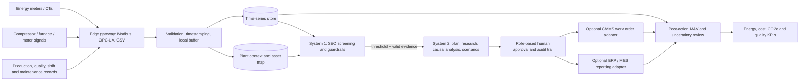

# ForgeOps Energy — Hackathon Solution Write-up

## 1. Problem statement

Indian manufacturing SMEs often receive electricity bills and monthly production summaries but lack a joined, machine-level view of energy per good tonne, equipment condition, production constraints, and tariff periods. This makes recurring waste difficult to isolate and makes retrofit decisions hard to justify. ForgeOps Energy is a retrofit-oriented energy decision-support prototype for foundries and forging SMEs. It detects an abnormal specific-energy pattern, organizes evidence, compares bounded interventions, and presents a human-reviewable action and measurement plan.

## 2. Proposed solution and mechanism

The prototype demonstrates a two-speed workflow:

1. **Observe:** ingest time-stamped meter, machine, production, quality, tariff, and maintenance data through an edge gateway or import adapter. The current demo uses synthetic Belgaum foundry fixtures; there is no live plant connection.
2. **Screen:** a deterministic fast loop calculates SEC (`kWh / good tonnes`), compares it with a plant/shift baseline, checks data quality, and flags deviations. A configurable threshold triggers deeper investigation.
3. **Investigate:** the four-role workflow (Planner, Research, Analysis, Execution) builds a plan, retrieves read-only evidence, tests causal hypotheses, and ranks candidate actions. Model output is advisory; rules and engineering guardrails bound actions.
4. **Simulate:** compare no-action and intervention scenarios for energy, throughput, quality, safety, downtime, cost, and emissions. A simulated result is an estimate, not a measurement.
5. **Review and act:** an authorized operator reviews the evidence and approves, rejects, or edits a recommendation. The current deployment records a demo decision; it does not actuate PLCs or dispatch a real CMMS work order.
6. **Measure and verify:** after a real intervention, compare a documented baseline with post-action meter and production data, normalize for operating conditions, and review uncertainty and quality/throughput guardrails. Independent M&V remains required before claiming realized savings.

## 3. Target plant and SME fit

Initial segment: single-site foundries and forging SMEs with one or more energy-intensive assets (compressors, induction furnaces, heat treatment, pumps, fans) and basic digital records. Begin with electricity submeters plus shift/batch output and maintenance history; do not require a new MES or replacement of existing controls. Use an industrial edge gateway for Modbus RTU/TCP or OPC-UA, local buffering during network outages, and outbound-only encrypted synchronization where connectivity permits. Start read-only; keep operator approval and existing interlocks in force. Provide CSV/manual upload as a low-cost onboarding path.

This is a prototype integration design, not an installed or validated product. Sensor accuracy, protocol compatibility, cyber-security review, plant safety approval, and integration effort must be confirmed site by site.

## 4. Technical architecture

**Implemented in this repository:** React/TypeScript workbench; FastAPI APIs; deterministic screening/simulation; four-role orchestration path; demo data and review UI; runtime status reporting. **Integration targets, not connected in this deployment:** industrial meters/PLCs, MES/QMS/ERP/CMMS, live plant telemetry, physical actuation, independent M&V. Local Sol-2B weights are present, but native inference is not active or validated in the current Python/CUDA environment; the deterministic fallback is the operating path.

## 5. Demonstration case and quantified scenario

The Belgaum story is a **synthetic scenario**, not field evidence. Its fixture states baseline SEC 9.8 kWh/t, incident SEC 11.2 kWh/t, and a modeled intervention output of 9.2 kWh/t. Relative to the incident point, the simulated reduction is `(11.2 − 9.2) / 11.2 = 17.9%`; relative to the stated normal baseline, the modeled result is 6.1% lower. The same fixture assumes good-output throughput of 10.2 t/h and yield of 97.6%; these are scenario guardrails, not proof that production or quality was preserved in a real intervention.

For a separate whole-site illustrative business case, assume annual electricity use of 3.65 GWh, a ₹7.80/kWh blended tariff, a 10% energy reduction, ₹1.20 lakh one-time installation, and ₹6,000/month software. These whole-site assumptions do not share a measurement boundary with the synthetic Line 2 SEC example above. The arithmetic is:

| Metric | Illustrative result | Formula / qualification |
|---|---:|---|
| Annual baseline electricity | 3,650,000 kWh | Planning assumption for a separate whole site |
| Annual baseline energy bill | ₹2.847 crore | kWh × ₹7.80 |
| Energy avoided at 10% | 365,000 kWh/year | Scenario assumption, not measured |
| Gross bill reduction | ₹28.47 lakh/year | Avoided kWh × ₹7.80 |
| Software fee | ₹0.72 lakh/year | ₹6,000 × 12 |
| Net annual operating benefit | ₹27.75 lakh/year | Before taxes, financing, maintenance, and downtime |
| Simple payback | 0.52 months | ₹1.20 lakh ÷ (₹27.75 lakh / 12) |
| Indicative Scope 2 reduction | 299.3 tCO2e/year | 365,000 × assumed 0.82 kg/kWh; replace with applicable factor and electricity boundary |

These are scenario economics only. The 10% saving, tariff, operating days, installation quote, and emissions factor must be replaced with plant-specific evidence. Savings must be normalized to good output and operating conditions. Preserve throughput, quality, and safety as hard constraints; if these fail, reject the option regardless of energy savings.

## 6. ADEETIE and policy fit

ForgeOps Energy could help organize baseline, proposed measure, DPR inputs, and post-implementation monitoring information for an SME and its energy auditor. It is not a BEE/SIDBI partner, accredited energy auditor, approved DPR generator, or subsidy administrator. BEE's ADEETIE scheme describes interest subvention (5% for micro/small and 3% for medium enterprises) on eligible loans, subject to scheme conditions; it is not a 25% equipment grant. Confirm current eligibility, cluster coverage, approved technology, loan, and documentation with the scheme and lending institution. Sources: [BEE ADEETIE](https://www.beeindia.gov.in/show_content.php?lang=1&level=1&lid=384&ls_id=234), [SIDHIEE scheme details](https://sidhiee.beeindia.gov.in/ProjectComponent/ADEETIE).

## 7. Deployment and business model

- **Pilot customer:** one foundry/forging site, initially one production line and its major electricity feeders.
- **Illustrative commercial package:** ₹1.2 lakh installation allowance plus ₹6,000/month SaaS. These are planning assumptions, not vendor quotes; site survey may change hardware and commissioning costs.
- **Pilot plan:** 2 weeks for survey/meter mapping and baseline data checks; 4–6 weeks read-only shadow operation; 2–4 weeks for an operator-approved maintenance/optimization trial; then at least 4 weeks of post-action data review. No automated control during pilot.
- **Success gates:** >=95% valid interval data; reconciled meter/production boundary; documented baseline and uncertainty; no statistically or operationally material deterioration in good-output throughput, first-pass yield, or safety; independently reviewed SEC delta; positive net savings after subscription and maintenance costs.
- **Scale-up:** repeatable asset templates for compressor systems first, then furnaces and drives; channel through local system integrators, energy auditors, foundry associations, and equipment service firms. Expand from one line to multi-line only after the pilot gates pass.
- **Revenue:** recurring per-site software subscription, optional commissioning/integration fee, and later paid analytics modules. Do not price on guaranteed savings until measurement, contract boundary, and independent verification are established.

## 8. Risks and mitigations

| Risk | Mitigation |
|---|---|
| Incomplete or misaligned meter and production data | Data-quality gate, time synchronization, explicit meter-to-process map, CSV fallback |
| False causal attribution | Show evidence and alternatives; use physics checks; require operator review and post-action measurement |
| Process quality, safety or throughput harm | Hard constraint checks, read-only pilot, no PLC actuation, operator and plant interlocks |
| SME budget and connectivity constraints | Start with critical feeders, offline buffer, phased hardware, transparent payback assumptions |
| Overclaiming savings or compliance | Label synthetic/modelled/measured separately; independent M&V; no certification language |
| AI/runtime variability | Deterministic fallback, model status/health disclosure, local-only loading option, reproducible scenario tests |

## 9. Prototype verification plan

The repository checks should cover SEC arithmetic and denominators; synthetic provenance in UI/API; scenario guardrails for throughput, yield, pressure and safe setpoints; approval required before any external action; model fallback when weights/runtime/CUDA are unavailable; and deterministic business-case formulas. This demonstrates software behavior only. A plant pilot and independent M&V are required to validate physical savings, integration effort, and customer payback.

## 10. Judging evidence boundary

The strongest defensible claim is that ForgeOps Energy demonstrates an end-to-end **decision-support workflow** with a synthetic foundry scenario, deterministic simulation, agent workflow, human approval design, and an explicit deployment/M&V plan. It has not demonstrated real sensor connectivity, real work-order dispatch, live Sol-2B inference, verified energy savings, certified emissions reporting, or a commercial customer deployment.
